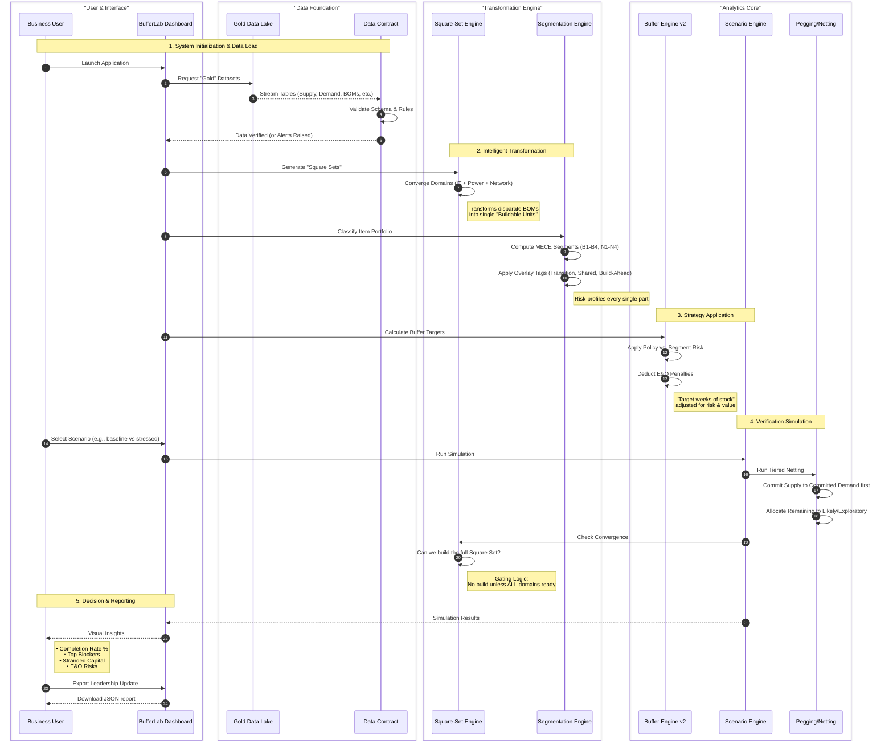

# BufferLab Analytics Workflow & Logic Explanation

## Executive Summary

**BufferLab (App 2)** transforms raw supply chain data into decision-grade insights for GPU deployment readiness. Unlike traditional reporting tools that simply sum up inventory, BufferLab uses a simulation approach: it models the "Square Set" (the converged unit of IT, Power, and Network), applies intelligent risk segmentation to every component, and simulates allocation based on demand confidence tiers.

This document outlines the end-to-end data and analytics workflow, demonstrating how the application turns static data into actionable deployment signals.

---

## Analytics Workflow Diagram

The following sequence diagram illustrates the "Lifecycle of a Decision" within BufferLab, from data ingestion to the final readiness signal.

---

## Detailed Logic Explanation

### 1. The Planning Object: "Square Sets"
Traditional planning tracks individual components (cables, servers, shelving). BufferLab elevates this to the **Square Set**—the minimum deployable unit of compute capacity.
*   **The Logic**: A "Square Set" is only considered feasible if its **IT Rack** (Compute), **Callan/HXU** (Cooling/Power), and **MOR/Network** (Connectivity) are *all* present.
*   **Business Value**: Prevents "partial builds" where you have expensive servers sitting idle because a low-cost network cable is missing.

### 2. The Intelligence: MECE Segmentation & Tagging
Instead of treating all parts equally, the **Segmentation Engine** classifies every item into distinct risk buckets (e.g., **B1** to **N4**) using a Mutually Exclusive, Collectively Exhaustive (MECE) framework.
*   **Base Segments**: Determined by three factors:
    1.  **Criticality**: Is it a Blocker? (Stops the build)
    2.  **Constraint**: Is supply scarce or unreliable?
    3.  **E&O Risk**: Is it high-cost and nearing end-of-life?
*   **Overlay Tags**: Nuanced flags like `transition_active` (item is being replaced by a new generation) or `long_lead_foundation` (takes months to arrive).
*   **Business Value**: Focuses human attention on the "Critical Few" rather than the "Trivial Many."

### 3. The Strategy: Dynamic Buffer Targets
The **Buffer Engine v2** moves away from static "one size fits all" safety stock.
*   **Tiered Posture**:
    *   **Committed Demand**: System authorizes full buffer coverage to guarantee delivery.
    *   **Likely/Exploratory**: System strictures inventory, capping it at minimum levels or zero (commitments only, no stock).
*   **E&O Penalty**: If an item is flagged as High Risk (High Value + Aging), the engine *automatically reduces* its buffer target.
*   **Business Value**: Maximizes readiness for committed plans while aggressively minimizing cash tied up in risky or speculative inventory.

### 4. The Simulation: Tiered Netting & Convergence
The **Scenario Engine** doesn't just subtract Demand from Supply; it runs a prioritized simulation.
*   **Tiered Netting**: It "fills" orders for Committed demand first. Only if excess supply exists does it allocate to Likely or Exploratory demand.
*   **Convergence Gate**: Even if you have the servers, the system will not mark a deployment as "Ready" (Green) unless all domains are ready based on on-hand availability (and optional power readiness).
*   **Business Value**: Provides a realistic, "clear to build" signal that accounts for real-world constraints, preventing false optimism.

### 5. Governance & Reporting
The final layer converts these complex calculations into simple business metrics.
*   **Completion Rate**: What % of our committed plan can we actually turn on?
*   **Stranded Capital**: What is the dollar value of inventory sitting idle due to missing cheap parts (blockers)?
*   **Top Blockers**: Which specific items are holding up the most square sets (largest gap quantities)?

This workflow ensures that every number on the dashboard is backed by rigorous, constraint-aware logic, making BufferLab a true **Decision Support System** rather than just a reporting tool.
